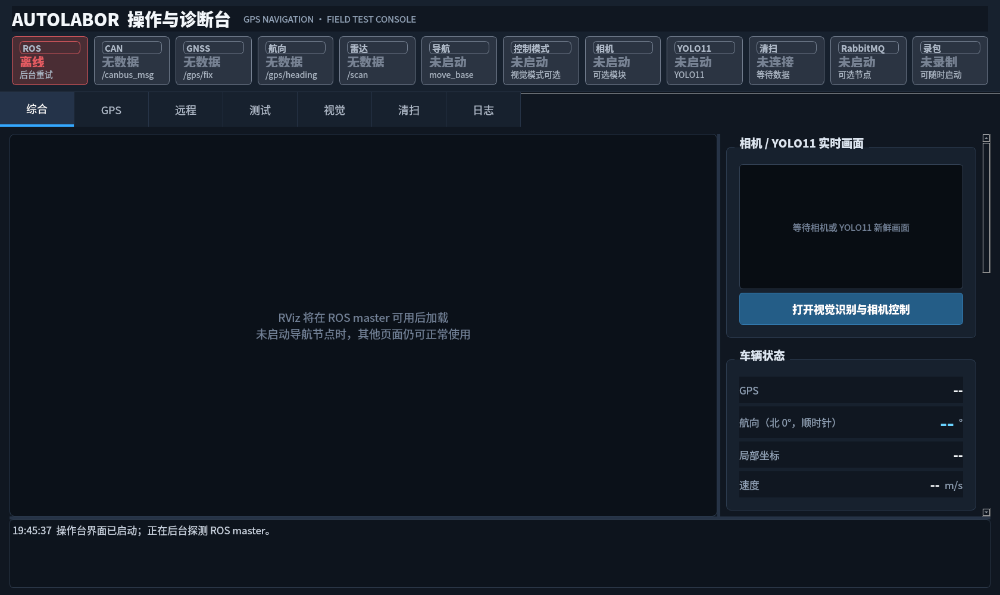
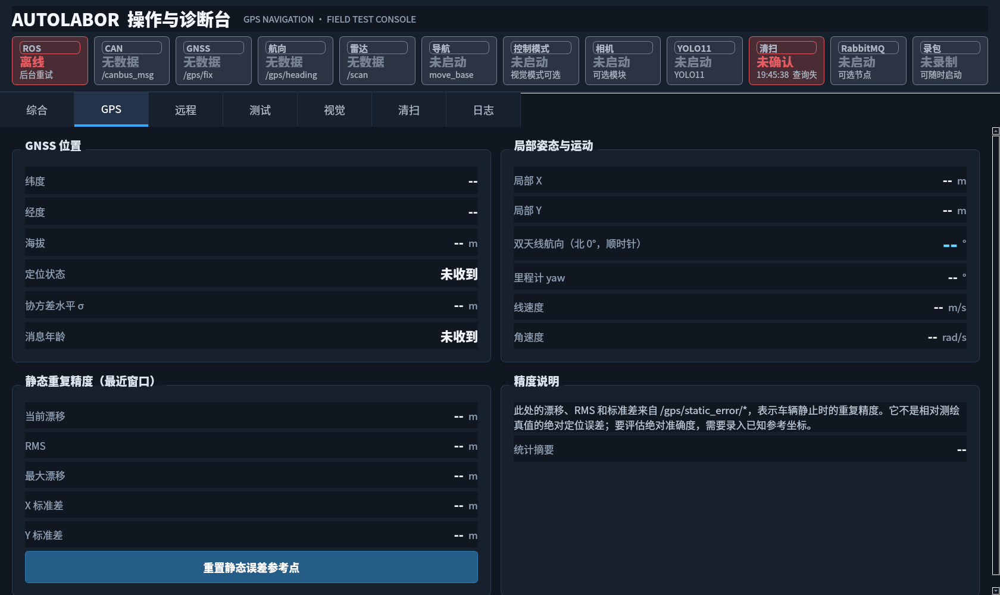
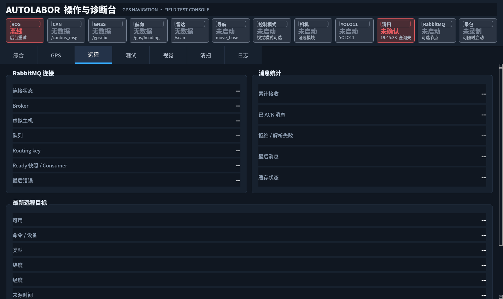
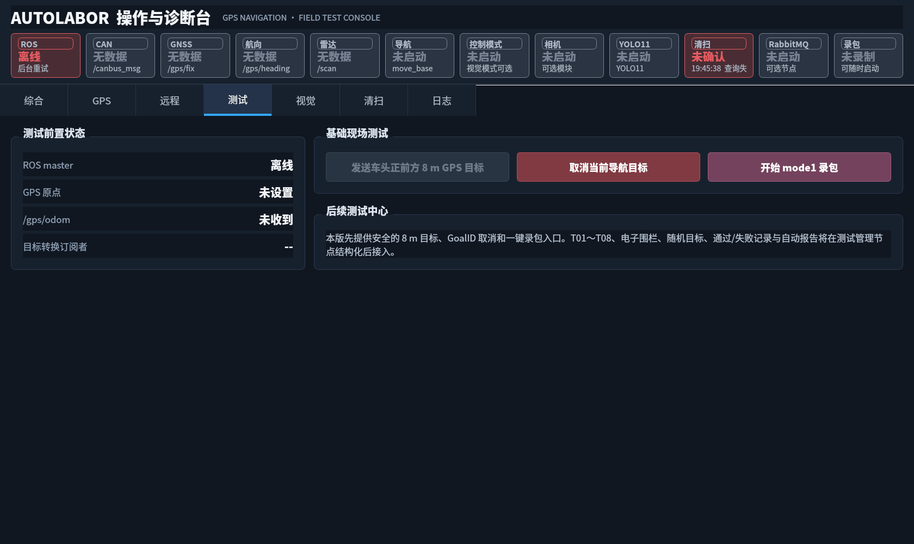
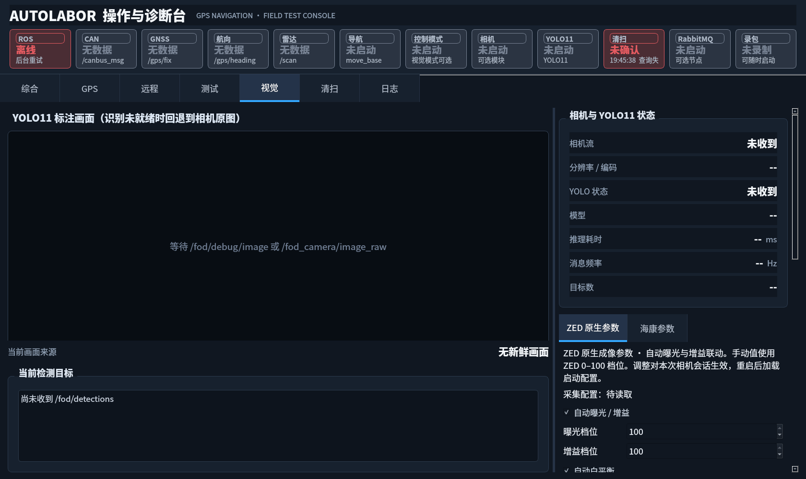
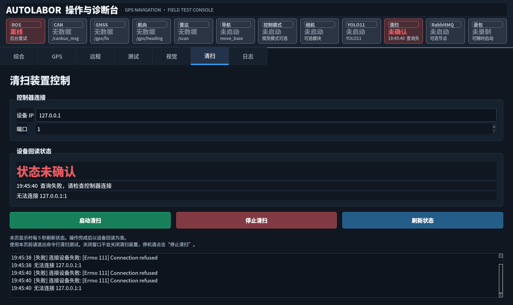
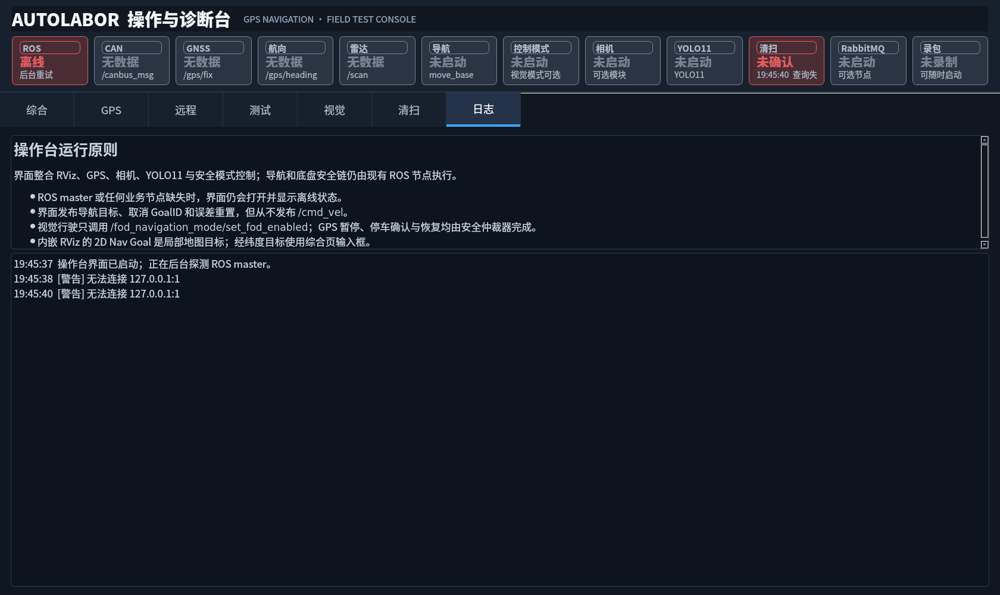

# 当前 Qt 界面设计

设计来源为当前项目的实际 C++ Qt Widgets 实现。下面截图由同一套控件离线渲染，显示设备未连接时的状态。没有单独的 `.ui`、QML 或设计软件工程。

## 页面结构

窗口顶部固定展示 ROS、CAN、GNSS、航向、雷达、导航、控制模式、相机、YOLO11、清扫、RabbitMQ、录包状态。中部为七个主页面；相机设置包含 ZED 和海康两个子页签。

| 页面 | 主要内容 | 实际截图 |
| --- | --- | --- |
| 综合 | 内嵌 RViz、检测画面、定位/航向、目标输入、导航与回收状态 | [综合](../docs/screenshots/01_overview.png) |
| GPS | 定位详情、局部坐标、静态误差与重置 | [GPS](../docs/screenshots/02_gps.png) |
| 远程 | RabbitMQ 通信状态、缓存目标、确认与清空 | [远程](../docs/screenshots/03_remote.png) |
| 测试 | 现场测试入口与运行信息 | [测试](../docs/screenshots/04_test.png) |
| 视觉 | 原始/检测画面、检测数据、回收模式、ZED/海康相机参数 | [视觉](../docs/screenshots/05_vision.png) |
| 清扫 | TCP 地址、端口、查询/启停、通信结果与日志 | [清扫](../docs/screenshots/06_sweep.png) |
| 日志 | 运行事件、故障提示 | [日志](../docs/screenshots/07_logs.png) |

## 配色与控件

| 用途 | 色值 |
| --- | --- |
| 页面底色 | `#101721` |
| 卡片/分组底色 | `#17212e` |
| 输入框/日志底色 | `#0d141d` |
| 主文字 | `#e7edf5` |
| 辅助文字 | `#8fa0b5` |
| 当前页签强调色 | `#34a8ff` |
| 主按钮 | `#245d87` |
| 输入框边框 | `#405067` |
| 正常 / 注意 / 故障 / 离线 | `#20b47a` / `#e5a93d` / `#e45b61` / `#778293` |

基础字体为 13 pt，优先使用 Noto Sans CJK SC、Microsoft YaHei。标题约 21 pt，状态值约 15 pt，状态说明约 10 pt。窗口启用 Qt 高 DPI 支持，初始尺寸为 1680 × 1000，最小尺寸为 1100 × 700；实际尺寸也受各页控件最小布局约束影响。

面板通常使用 8 px 圆角、按钮 6 px 圆角。常规按钮最小高度 44 px，清扫大按钮为 56 px。设备状态同时通过文字和彩色指示呈现。异步设备请求显示处理中状态，避免阻塞界面。

## 修改位置

- 主窗口、状态卡片、七页布局：`src/application/autolabor_operator_gui/src/main_window.cpp` 中 `buildUi()` 与各 `build*Page()`。
- 全局样式：同文件 `buildUi()` 内的 `setStyleSheet()`；[theme.qss](theme.qss) 提供设计参考。各面板也有局部样式。
- 清扫页面：`sweep_panel.cpp` / `sweep_panel.h`。
- ZED 原生设置：`zed_camera_panel.cpp` / `zed_camera_panel.h`。
- RViz 视图：`src/application/autolabor_operator_gui/config/operator_navigation.rviz` 和 `operator_indoor.rviz`。

控件与回调保留当前项目实现。界面展示的导航/识别结果来自 ROS 后台，修改显示布局不需要引入后台算法。

## 截图预览

